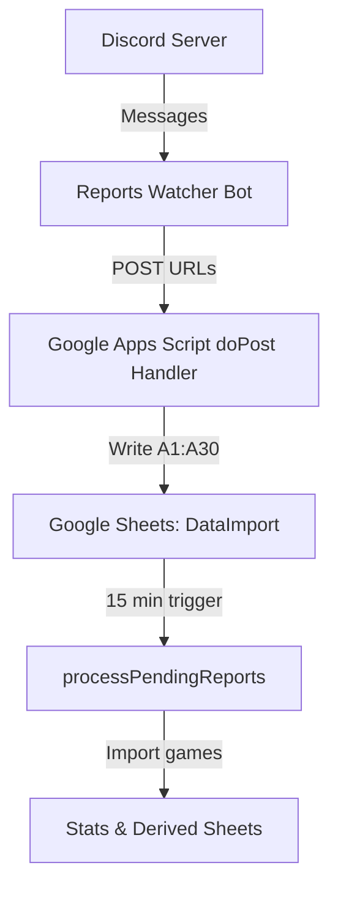

# Reports Watcher Bot

A Discord bot and Google Sheets pipeline that automatically collects QuakeWorld match reports from Discord, queues them in Google Sheets, and processes them on a scheduled basis.

📦 **Repository:** https://github.com/kindzal/qw-reports-watcher

---

## 🚀 Overview

The Reports Watcher Bot:

- Listens to a **configurable Discord channel**
- Extracts games URLs in the format:
  ```
  https://hub.quakeworld.nu/games/?gameId=
  ```
- Sends valid URLs to a Google Apps Script endpoint

The Google Apps Script endpoint:

- Validates and stores URLs in a Google Sheet queue
- Processes pending reports every **15 minutes**

The system cleanly separates **ingestion** from **processing** for reliability and scalability.

---

## 🧱 Architecture


```mermaid
flowchart TD
    A[Discord Server] -->|Messages| B[Reports Watcher Bot]
    B -->|POST URLs| C[Google Apps Script doPost Handler]
    C -->|Write A1:A30| D[Google Sheets: DataImport]

    D -->|15 min trigger| E[processPendingReports]
    E -->|Import games| F[Stats & Derived Sheets]
```

---

## 🤖 Discord Bot

### Scopes & invite
A new application needs to be created for each instance of the bot using Discord Developer Portal https://discord.com/developers/applications

#### Bot tab 
`Message Content Intent` is required for the bot to be able to access message content so make sure it is selected.
Use `Reset Token` button to create a new token and make a note of it. It will be required to configure the URL post service later.

#### OAuth2 tab 
Using `OAuth2 URL Generator` generate the invite URL by selecting 'bot' from the `Scopes` list then the following from the `Bot Permissions` list:
- View Channels
- Read Message History
- Add Reactions

Copy `Generated URL` and use the link to invite the bot to the required server.
When inviting the bot make sure all scopes are ticked.

### Features
- Built with **Node.js** and **discord.js**
- Monitors a single Discord channel (configured via env var)
- Filters valid match URLs only
- Sends batched URLs to Google Apps Script
- Runs an Express HTTP server for uptime monitoring

### Health Check Endpoint
Visiting the bot URL returns:

```
Reports Watcher bot is running!
```

---

### Payload example

```
{
  "urls": [
    "https://hub.quakeworld.nu/games/?gameId=193985",
    "https://hub.quakeworld.nu/games/?gameId=193986",
    "https://hub.quakeworld.nu/games/?gameId=193987"
  ]
}
```

## 🔐 Environment Variables

The bot is fully configured via environment variables:

| Variable | Description |
|--------|-------------|
| `DISCORD_TOKEN` | Discord bot token |
| `GOOGLE_WEBHOOK` | Google Apps Script Web App `/exec` URL or short URL |
| `REPORTS_CHANNEL_NAME` | Discord channel name to monitor |

This allows deploying **multiple instances** of the same codebase for different servers or channels.
Ideally Google Apps Script Web App URL (`GOOGLE_WEBHOOK`) is shortened using an external service like Short.io so the environment vairable does not have to change upon each deployment of the backend.

---

## ☁️ Hosting (Railway)

- The bot runs on **Railway**
- Environment variables are managed in the Railway dashboard
- Each deployment = one independent bot instance
- Public URL is used for uptime monitoring

---

## ⏱️ Uptime Monitoring

**UptimeRobot** pings the bot’s HTTP endpoint periodically to check its health

---

## 📊 Google Apps Script endpoint

### Purpose
Acts as a lightweight ingestion endpoint.

### Behavior
- Receives JSON payloads via `doPost(e)`
- Validates incoming URLs
- Writes URLs into:
  ```
  DataImport!A1:A30
  ```

### Important
The endpoint **does NOT**:
- Import game data
- Update stats
- Run any heavy processing

---

## 📑 Google Sheets Backend

### Sheet: `DataImport`
- Acts as a queue of pending reports
- Accepts up to **30 URLs** at a time (`A1:A30`)

### Scheduled Processing
- Function: `processPendingReports()`
- Trigger: Time-based, every **15 minutes**
- Responsibilities:
  - Fetch game data
  - Update stats
  - Maintain derived sheets

This design ensures ingestion is fast and processing is reliable.

---

## 🔄 End-to-End Workflow

1. Player posts QuakeWorld hub game links on Discord
2. Bot validates and extracts the URLs
3. Bot POSTs URLs to Apps Script
4. Apps Script writes to Google Sheets
5. `processPendingReports()` runs every 15 minutes
6. Game data is imported and stats updated

---

## 🧪 Testing

### Bot Health
Open the Railway app URL in a browser:
```
Reports Watcher bot is running!
```

### Discord Test
- Post a valid match URL in the configured channel
- Confirm it appears in the `DataImport` sheet

### Processing Test
- Wait for the 15-minute trigger
- Verify stats update as expected

---

## 📦 Deployment Strategy

You can deploy multiple instances using the same code:

| Instance | Channel | Discord Server |
|--------|--------|----------------|
| Bot A | reports | Server A |
| Bot B | tournament-reports | Server B |
| Bot C | private-matches | Server C |

Each instance:
- Has its own Discord token
- Uses its own environment variables
- Runs independently

---

## ✅ Design Goals Achieved

- Clean separation of ingestion vs processing
- Configurable per deployment
- Stateless web ingestion
- Reliable scheduled processing
- Free-tier friendly
- Fully version controlled

# Prerequisities

- Deploy the **Apps Script code / Web frontend / API** and configure the Google Sheet backend
  👉 https://github.com/kindzal/qw-tourney-management
